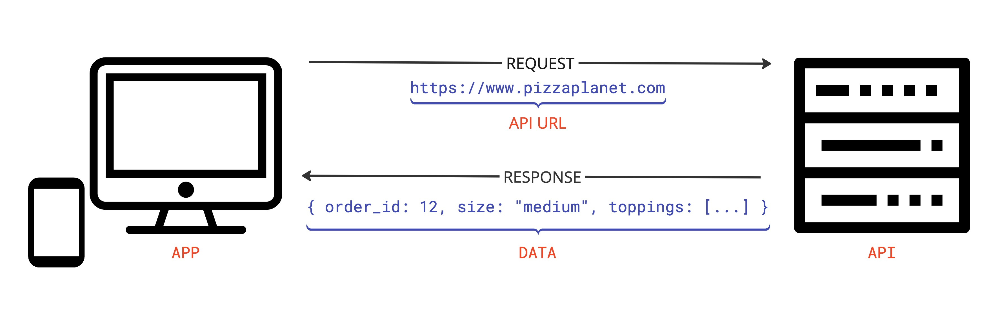

# The Lesson:
Imagine you're ordering a delicious pizza 🍕. When you call the restaurant, you don't stand there waiting by the phone, staring at it intensely. Instead, you get a "promise" that your pizza will be delivered. You can continue doing other things while waiting - maybe set the table, grab a drink, or watch some TV. When the pizza arrives, you handle it. If something goes wrong, the delivery person lets you know.

JavaScript Promises work exactly the same way!

*Take a look at the image below:*


Here is how the code would look for this request:


```js
const response = await fetch("https://indoatlantis.com/rest_api/last_transaction")
const pizza = await response.json()

// Do stuff with pizza!

// Now, and only now that we awaited those asynchronous operations we can do what every we want with our pizza.
```

# The Project:

## Setup
1. In your workspace, create a new directory called `Pizza-Db`
2. In `Pizza-Db` create a database file: `touch database.json`
3. Paste the following code in your `database.json` file:
  ```json
  {
  "pizzas": [
    {
      "id": 1,
      "name": "Pepperoni Explosion",
      "size": "medium",
      "toppings": ["pepperoni", "mushrooms", "onion"],
      "crust": "hand tossed"
    },
    {
      "id": 2,
      "name": "Sausage Showdown",
      "size": "large",
      "toppings": ["sausage", "peppers", "red onion"],
      "crust": "deep dish"
    },
    {
      "id": 3,
      "name": "Pineapple Pandemonium",
      "size": "small",
      "toppings": ["pineapple", "olives"],
      "crust": "thin"
    },
    {
      "id": 4,
      "name": "Deli Delight",
      "size": "medium",
      "toppings": ["ham", "salami", "pepperoni"],
      "crust": "Brooklyn"
    },
    {
      "id": 5,
      "name": "Cluckin' Good",
      "size": "large",
      "toppings": ["chicken", "mushrooms", "onion"],
      "crust": "gluten free"
    },
    {
      "id": 6,
      "name": "Spicy Sensation",
      "size": "small",
      "toppings": ["pepperoni", "sausage", "peppers"],
      "crust": "cheese stuffed"
    },
    {
      "id": 7,
      "name": "Mediterranean Melody",
      "size": "medium",
      "toppings": ["olives", "pineapple", "ham"],
      "crust": "thin"
    },
    {
      "id": 8,
      "name": "Veggie Volcano",
      "size": "large",
      "toppings": ["sausage", "onion", "peppers"],
      "crust": "deep dish"
    },
    {
      "id": 9,
      "name": "Pepperoni Paradise",
      "size": "small",
      "toppings": ["pepperoni", "mushrooms", "salami"],
      "crust": "hand tossed"
    },
    {
      "id": 10,
      "name": "Tropical Tornado",
      "size": "medium",
      "toppings": ["chicken", "pineapple", "red onion"],
      "crust": "gluten free"
    }
  ]
}
```
4. Serve your api with JSON server: `json-server -p 8088 database.json`

## 🍕 Welcome to Daves Wacky Pizza Delivery! 🍕

Dave has asked us to help him make a quick application for his Pizza Bussines that will allow his customers to order from him!
Here is what he asked for: 
- A button that will generate a randome pizza,
- Display the toppings, size, crust, and the name of the Pizza
  
Thats It!

Using Async & Await, please help Dave generate Wacky Pizzas for his customers. 


### Follow up Questions:
- What is Async
- What is Await
- When should you use Async/ Await
- What are the benefits
